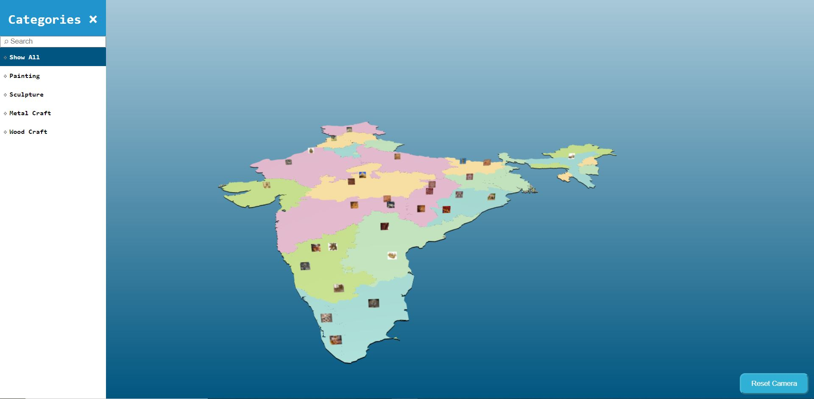

# Threejs-Interactive-3D-India-Map
A project created with IDC - IIT Bombay for Ministry of Culture. Uses Interactive 3D visuals to display artifacts information of different cultures across India in a visual manner.

Tech Stack:
Angular 1.X,
D3.js,
Three.js,
WebGL

Video of Implimentation:
